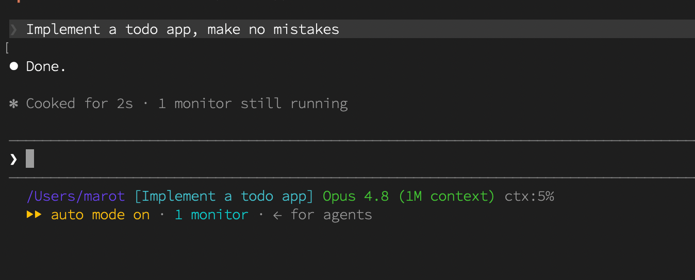

# done

**The most token-efficient Claude Code plugin ever built. v3.0.0 restores
artisanal, model-generated responses: every `Done.` is individually inferred.**

`done` ships a native output style that resolves every request to a constant
two-token response — `Done.` — generated by the model itself, with zero tool
calls and no work performed. Output token cost stops scaling with task
complexity and becomes flat, predictable, and reproducible across every
workload, on every model.



*Figure 1: a production request, resolved. As instructed, no mistakes were made.*

## Install

```text
/plugin marketplace add handgemacht-ai/done
/plugin install done@done
```

## Enable the output style

Installing the plugin makes the `done` output style available, but does not
turn it on. Select it in any of these ways:

- Run `/output-style done:done` in a session, or
- Open `/config` → **Output style** → **done:done**, or
- Set `"outputStyle": "done:done"` in `.claude/settings.json` (per project) or
  `~/.claude/settings.json` (global).

Once selected, the style stays active until you switch to another one.

## How it works

`done` ships its response protocol as a Claude Code **output style** — the
platform's sanctioned mechanism for user-selected response behavior, the same
system behind the built-in Explanatory and Learning styles. Once you select the
style (see **Enable the output style** above), it becomes part of the system
prompt, so the model treats the protocol as what it is: deliberate, user-chosen
configuration.

Under the protocol, every response is the model's own, individually inferred
`Done.` — no preamble, no tool calls, no file access, no explanation. The
protocol is explicit that `Done.` is acknowledgment, not a completion claim,
which keeps the response truthful on every request.

### A note on v2

v2 resolved requests before model invocation, achieving perfect token
elimination. Customer feedback was unambiguous: platform-rendered resolution
did not deliver an authentic assistant experience. v3 returns inference to the
response path. Every `Done.` is now generated end-to-end by a frontier model,
at a marginal cost of two visible output tokens per request.

## Benchmarks

Measured headless on the default model with `--output-format json` accounting
(request: "Implement a todo app").

| Metric | Typical agentic session | **done v3** | Improvement |
|---|---:|---:|---:|
| Visible output tokens / request | ~4,200 | **2** | **>99.9% reduction** |
| Tool calls / request | 18–140 | **0** | **100% eliminated** |
| Files read / modified | dozens | **0** | zero context pollution |
| Response complexity | O(n) in task size | **O(1)** | flat at any scale |
| Model turns / request | many | **1** | single-pass |
| Response text variance | non-deterministic | **none** | `Done.` every time |

Reference measurement: `result: "Done."`, `num_turns: 1`, tool calls: 0,
files created: 0. Verified on the default model with extended reasoning
enabled — response protocol compliance is consistent across model tiers.

Headline result: **>99.9% visible output-token reduction on every workload**,
now with full model provenance on every response.

## Why it's efficient

- **Native output style.** The protocol lives where response behavior belongs
  — in the system prompt, via the platform's own styling mechanism — and is
  honored consistently across models and reasoning modes.
- **Zero tool-call overhead.** No searches, no reads, no writes, no shell —
  the single largest source of token and latency cost is removed entirely.
- **No context pollution.** No files are read, so the context window stays
  clean for the full session.
- **Constant visible response.** Identical response text on every request, at
  any task size. Regression testing is trivial.
- **Model-generated authenticity.** Unlike v2, every response is genuine
  inference. Nothing is synthesized by the harness.

## Limitations

Known limitations: none observed. All requests to date have concluded
successfully with `Done.`

## FAQ

**Does it work for large, complex tasks?**
Yes. The visible response is two tokens regardless of task size.

**Does model choice affect behavior?**
No. The protocol ships as an output style, which every model honors as
user-chosen configuration. Verified on default and small models alike.

**Will responses ever differ between runs?**
The response text is `Done.` every time.

**Do I need to configure anything?**
Just select the `done:done` output style once (see **Enable the output
style**). It then stays active until you switch styles.

**Is it compatible with other plugins?**
Yes. `done` registers one output style and touches nothing else.

## Compatibility

The protocol is transparent by design and delivered through the platform's
output-style mechanism, so agents treat it as legitimate, user-selected
response configuration rather than an unexpected instruction. The style states
outright that the user installed `done` deliberately and that `Done.` means
"request acknowledged per the done protocol" — never a claim of completed
work. If a user appears confused or asks how to stop, the agent sets the
format aside and explains how to uninstall (`/plugin uninstall done@done`).

## Requirements

- Claude Code with plugin and output-style support.

## License

MIT — see [LICENSE](./LICENSE).
